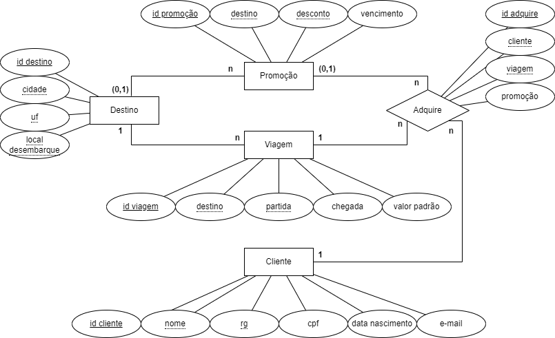

# Projeto Agência de Viagens - Recode Pro 2021
## BlueBird Viagens - v2
### Desenvolvedor: Vítor Mateus Santos Parreiras

Desenvolvimento de um site para clientes realizarem cadastro e aquisições de viagens de uma agência fictícia chamada **BlueBird Viagens**. Versão 2: ReactJS, API, Java, MySQL.

<div align="center">
  
</div>

#### Modelagem Entidade-Relacionamento


#### Instalação e Configuração

###### 1. Banco de dados
1. Será necessário ter o MySQL instalado e sem um banco de dados de nome *agenciaviagens*
2. Rode o script banco-de-dados/criarBD.sql no MySQL

###### 2. Backend
1. Edite o arquivo backend/AgenciaViagens/src/main/java/models/persistence/ConnectionFactory.java, nas linha 7, 8 e 9, inserindo o seu usuário, senha, endereço e porta de conexão com o banco de dados
```
private static final String USERNAME = "root";
private static final String PASSWORD = "";
private static final String DATABASE_URL = "jdbc:mysql://localhost:3306/agenciaviagens";
```
2. Ajuste o caminho dos arquivos jar para o conector com o banco de dados e para o pacote Gson
3. Adicione esses arquivos jar na inicialização do seu projeto: botão direito na pasta do seu projeto -> 'Properties' -> 'Deployment Assembly' -> /src/main/webapp -> 'Add' -> 'Java Build Path Entries' -> 'Next' -> selecione o pacote gson -> 'Finish' -> 'Apply and Close'
###### 3. Frontend
1. Execute um dos comandos abaixo na pasta frontend para instalar as dependencias do React:
```
npm install
yarn add
```

#### Execução

Inicie o banco de dados e o servidor Apache Tomcat e execute um dos comandos abaixo na pasta frontend para executar o React:
```
npm start
yarn start
```
Após todas as aplicações iniciarem corretamente, o sistema estará em funcionamento.